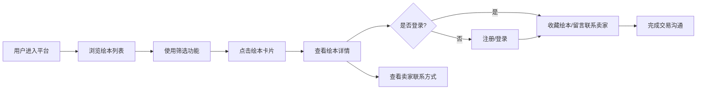

## 1. 产品概述
小区二手绘本交易平台，帮助家长将孩子看过的绘本进行二次流转，支持出售或免费赠送，促进社区内资源共享。
- 目标用户：小区内有0-12岁孩子的家长
- 核心价值：低成本获取绘本、闲置绘本变现/赠送、建立邻里阅读交流

## 2. 核心功能

### 2.1 用户角色
| 角色 | 注册方式 | 核心权限 |
|------|----------|----------|
| 普通用户 | 手机号/用户名注册 | 浏览绘本、发布绘本、收藏、留言、联系卖家 |

### 2.2 功能模块
1. **用户认证模块**：注册、登录、退出登录、个人信息
2. **绘本列表模块**：绘本展示、年龄段筛选、免费/付费筛选、搜索
3. **绘本详情模块**：绘本详情展示、卖家信息、联系卖家
4. **发布绘本模块**：上传绘本信息、设置价格或免费、选择年龄段
5. **收藏模块**：收藏绘本、查看收藏列表
6. **留言模块**：绘本留言、留言列表

### 2.3 页面详情
| 页面名称 | 模块名称 | 功能描述 |
|-----------|-------------|---------------------|
| 登录/注册页 | 表单模块 | 用户输入用户名、密码、手机号进行注册或登录 |
| 首页/列表页 | 筛选栏 | 年龄段筛选（0-3岁、3-6岁、6岁以上）、免费/付费切换 |
| 首页/列表页 | 绘本卡片列表 | 展示绘本封面、标题、价格、年龄段、卖家信息 |
| 绘本详情页 | 绘本信息 | 展示完整绘本信息、图片、描述、品相 |
| 绘本详情页 | 卖家信息 | 显示卖家昵称、联系方式、留言区 |
| 绘本详情页 | 留言模块 | 查看留言、发布留言 |
| 发布绘本页 | 发布表单 | 填写绘本标题、作者、分类、年龄段、价格、描述、图片 |
| 我的页面 | 个人信息 | 展示用户信息、我的发布、我的收藏 |

## 3. 核心流程

用户进入平台后，可直接浏览绘本列表，使用筛选功能查找目标年龄段和价格类型的绘本。点击绘本卡片进入详情页，查看绘本详细信息和卖家联系方式。用户注册登录后可发布自己的绘本、收藏感兴趣的绘本、在详情页给卖家留言咨询。

## 4. 用户界面设计
### 4.1 设计风格
- 主色调：温暖的橙色/珊瑚色 #FF7A59，搭配柔和的米白色背景
- 辅助色：柔和的绿色 #4CAF50（免费标签）、深蓝色 #2D3748（文字）
- 按钮风格：圆角按钮，hover时有轻微阴影和颜色加深效果
- 字体：中文使用思源黑体，标题加粗，正文常规
- 布局风格：卡片式布局，顶部导航栏，网格状绘本列表
- 图标风格：简洁的线性图标，配合emoji增加童趣感

### 4.2 页面设计概览
| 页面名称 | 模块名称 | UI元素 |
|-----------|-------------|-------------|
| 列表页 | 顶部导航 | Logo、搜索框、登录/用户头像、发布按钮 |
| 列表页 | 筛选栏 | 年龄段Tab切换、免费/付费开关、网格列表 |
| 列表页 | 绘本卡片 | 封面图、标题、价格标签、年龄段标签、卖家昵称 |
| 详情页 | 内容区 | 大图轮播、标题、价格、年龄段、分类、品相、描述 |
| 详情页 | 卖家区 | 卖家头像、昵称、联系方式、收藏按钮、留言按钮 |
| 详情页 | 留言区 | 留言列表、留言输入框 |
| 发布页 | 表单区 | 各项输入框、图片上传、提交按钮 |

### 4.3 响应式设计
- 采用桌面优先设计，自适应移动端
- 桌面端：3-4列网格布局
- 平板端：2列网格布局
- 移动端：单列布局，底部导航栏
- 所有交互元素支持触摸操作
