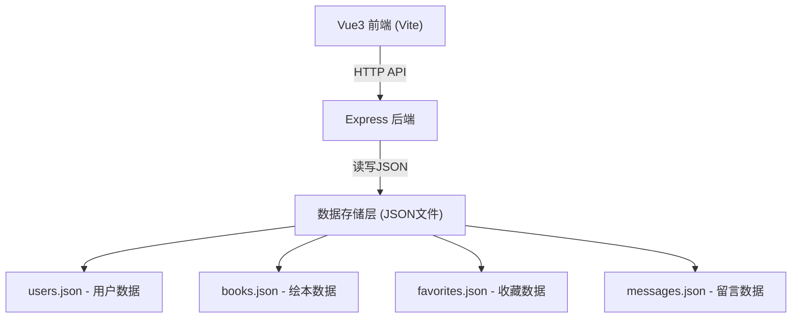
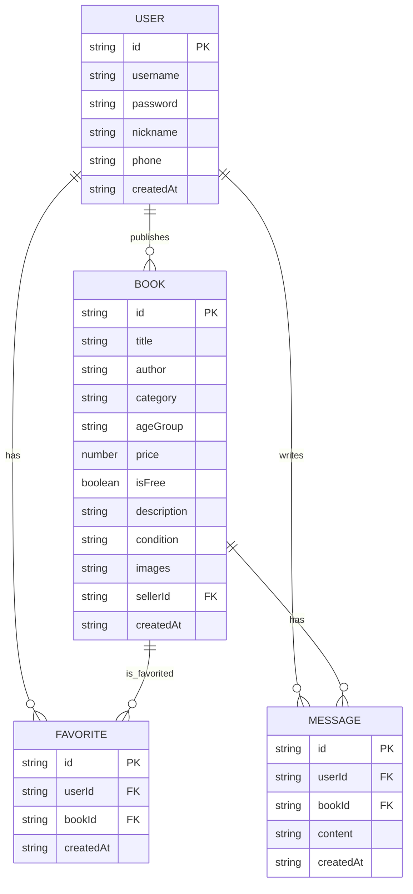

## 1. 架构设计



## 2. 技术说明
- 前端：Vue@3 + TypeScript + Vite + Vue Router + Tailwind CSS
- 初始化工具：vite-init
- 后端：Express@4 + TypeScript
- 数据存储：JSON文件（无需数据库）
- 状态管理：Vue Composition API + localStorage（用户登录态）

## 3. 路由定义

| 前端路由 | 用途 |
|-------|---------|
| / | 绘本列表首页（含筛选功能） |
| /book/:id | 绘本详情页 |
| /publish | 发布绘本篇（需登录） |
| /login | 登录页 |
| /register | 注册页 |
| /mine | 个人中心（我的发布、我的收藏，需登录） |

## 4. API 定义

### 4.1 用户相关接口

```typescript
// 用户注册
POST /api/users/register
Request: { username: string, password: string, phone: string, nickname: string }
Response: { success: boolean, data: { id: string, username: string, nickname: string, phone: string }, message?: string }

// 用户登录
POST /api/users/login
Request: { username: string, password: string }
Response: { success: boolean, data: { id: string, username: string, nickname: string, phone: string }, message?: string }

// 获取用户信息
GET /api/users/:id
Response: { success: boolean, data: { id: string, username: string, nickname: string, phone: string }, message?: string }
```

### 4.2 绘本相关接口

```typescript
// 获取绘本列表（支持筛选）
GET /api/books?ageGroup=0-3&type=free&keyword=xxx
Query Params:
  - ageGroup?: '0-3' | '3-6' | '6+' | 'all'
  - type?: 'free' | 'paid' | 'all'
  - keyword?: string
Response: { success: boolean, data: Book[] }

// 获取绘本详情
GET /api/books/:id
Response: { success: boolean, data: Book & { seller: User }, message?: string }

// 发布绘本（需登录）
POST /api/books
Request: { title: string, author: string, category: string, ageGroup: '0-3' | '3-6' | '6+', price: number, isFree: boolean, description: string, condition: string, images: string[], sellerId: string }
Response: { success: boolean, data: Book, message?: string }

// 获取我的绘本发布
GET /api/users/:id/books
Response: { success: boolean, data: Book[] }

// 删除绘本
DELETE /api/books/:id
Response: { success: boolean, message?: string }
```

### 4.3 收藏相关接口

```typescript
// 收藏绘本
POST /api/favorites
Request: { userId: string, bookId: string }
Response: { success: boolean, message?: string }

// 取消收藏
DELETE /api/favorites
Request: { userId: string, bookId: string }
Response: { success: boolean, message?: string }

// 获取我的收藏列表
GET /api/users/:id/favorites
Response: { success: boolean, data: Book[] }

// 检查是否已收藏
GET /api/favorites/check?userId=xxx&bookId=xxx
Response: { success: boolean, data: boolean }
```

### 4.4 留言相关接口

```typescript
// 获取绘本留言
GET /api/books/:id/messages
Response: { success: boolean, data: Array<Message & { user: User }> }

// 发布留言
POST /api/messages
Request: { userId: string, bookId: string, content: string }
Response: { success: boolean, data: Message, message?: string }
```

## 5. 数据模型

### 5.1 数据模型定义



### 5.2 JSON 数据结构示例

**users.json:**
```json
[
  {
    "id": "user_001",
    "username": "parent1",
    "password": "123456",
    "nickname": "小明妈妈",
    "phone": "13800138001",
    "createdAt": "2026-06-01T10:00:00Z"
  }
]
```

**books.json:**
```json
[
  {
    "id": "book_001",
    "title": "好饿的毛毛虫",
    "author": "艾瑞·卡尔",
    "category": "启蒙认知",
    "ageGroup": "0-3",
    "price": 0,
    "isFree": true,
    "description": "很新的绘本，孩子已经看过了，免费送给需要的家长",
    "condition": "九成新",
    "images": ["https://..."],
    "sellerId": "user_001",
    "createdAt": "2026-06-10T10:00:00Z"
  }
]
```

**favorites.json:**
```json
[
  {
    "id": "fav_001",
    "userId": "user_002",
    "bookId": "book_001",
    "createdAt": "2026-06-15T10:00:00Z"
  }
]
```

**messages.json:**
```json
[
  {
    "id": "msg_001",
    "userId": "user_002",
    "bookId": "book_001",
    "content": "请问这本绘本还在吗？我想领，可以自提",
    "createdAt": "2026-06-16T10:00:00Z"
  }
]
```
